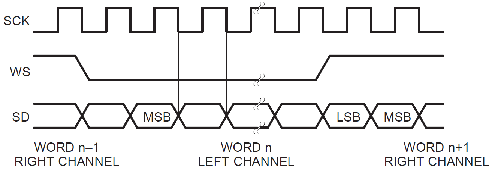
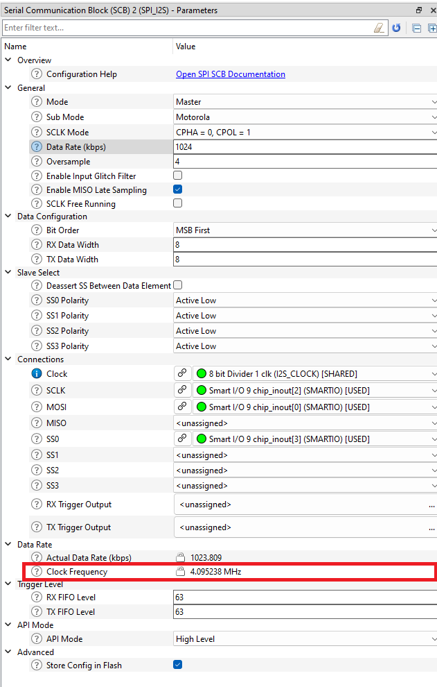

# PSoC&trade; 6 MCU: Smart I/O I2S master

This code example uses a SPI resource and smart I/O in PSoC&trade; 6 MCU to implement the Inter-IC Sound (I2S) master interface (Tx only).

[View this README on GitHub.](https://github.com/Infineon/mtb-example-psoc6-smartio-i2s)

[Provide feedback on this code example.](https://cypress.co1.qualtrics.com/jfe/form/SV_1NTns53sK2yiljn?Q_EED=eyJVbmlxdWUgRG9jIElkIjoiQ0UyMzE0NDMiLCJTcGVjIE51bWJlciI6IjAwMi0zMTQ0MyIsIkRvYyBUaXRsZSI6IlBTb0MmdHJhZGU7IDYgTUNVOiBTbWFydCBJL08gSTJTIG1hc3RlciIsInJpZCI6InJsb3MiLCJEb2MgdmVyc2lvbiI6IjIuMi4wIiwiRG9jIExhbmd1YWdlIjoiRW5nbGlzaCIsIkRvYyBEaXZpc2lvbiI6Ik1DRCIsIkRvYyBCVSI6IklDVyIsIkRvYyBGYW1pbHkiOiJQU09DIn0=)


## Requirements

- [ModusToolbox&trade;](https://www.infineon.com/modustoolbox) v3.0 or later (tested with v3.1)
- Board support package (BSP) minimum required version: 4.0.0
- Programming language: C
- Associated parts: All [PSoC&trade; 6 MCU](https://www.infineon.com/psoc6) parts

## Supported toolchains (make variable 'TOOLCHAIN')

- GNU Arm&reg; Embedded Compiler v10.3.1 (`GCC_ARM`) – Default value of `TOOLCHAIN`
- Arm&reg; Compiler v6.16 (`ARM`)
- IAR C/C++ Compiler v9.30.1 (`IAR`)

## Supported kits (make variable 'TARGET')

- [PSoC&trade; 6 Wi-Fi Bluetooth&reg; Prototyping Kit](https://www.infineon.com/CY8CPROTO-062-4343W) (`CY8CPROTO-062-4343W`) – Default value of `TARGET`
- [PSoC&trade; 6 Wi-Fi Bluetooth&reg; Pioneer Kit](https://www.infineon.com/CY8CKIT-062-WIFI-BT) (`CY8CKIT-062-WIFI-BT`)
- [PSoC&trade; 6 Bluetooth&reg; LE Pioneer Kit](https://www.infineon.com/CY8CKIT-062-BLE) (`CY8CKIT-062-BLE`)
- [PSoC&trade; 6 Bluetooth&reg; LE Prototyping Kit](https://www.infineon.com/CY8CPROTO-063-BLE) (`CY8CPROTO-063-BLE`)
- [PSoC&trade; 62S2 Wi-Fi Bluetooth&reg; Pioneer Kit](https://www.infineon.com/CY8CKIT-062S2-43012) (`CY8CKIT-062S2-43012`)
- [PSoC&trade; 64 "Secure Boot" Wi-Fi Bluetooth&reg; Pioneer Kit](https://www.infineon.com/CY8CKIT-064B0S2-4343W) (`CY8CKIT-064B0S2-4343W`)
- [PSoC&trade; 62S4 Pioneer Kit](https://www.infineon.com/CY8CKIT-062S4) (`CY8CKIT-062S4`)
- [PSoC&trade; 62S2 Evaluation Kit](https://www.infineon.com/CY8CEVAL-062S2) (`CY8CEVAL-062S2`, `CY8CEVAL-062S2-LAI-4373M2`, `CY8CEVAL-062S2-MUR-43439M2`, `CY8CEVAL-062S2-LAI-43439M2`)


## Hardware setup

You need a third-party module - [Pmod I2S2: stereo audio input and output](https://store.digilentinc.com/pmod-i2s2-stereo-audio-input-and-output/) to run this application. Additionally, you must manually wire the following connections:

I2S signal   | Kit pins              | Pmod IS2S pins
:----------- | :---------------------| :-------------
TX_SCK       | P9[2]                 |   J1.3
TX_DATA      | P9[0]                 |   J1.4
TX_WS        | P9[3]                 |   J1.2
MCLK         | See **Table 1**   |   J1.1
GND          | GND                   |   GND
VCC          | V3.3                  |   VCC

<br>

See **Table 1** to determine the MCLK pin for the respective kits:

**Table 1. MCLK_PIN selection for different targets**

Kit                      | MCLK_PIN
:------------------------|---------
CY8CPROTO-062-4343W      |  P5 [6]
CY8CKIT-062-WIFI-BT      |  P5 [6]
CY8CKIT-062-BLE          |  P5 [6]
CY8CPROTO-063-BLE        |  P5 [6]
CY8CKIT-062S2-43012      |  P5 [6]
CY8CKIT-064B0S2-4343W    |  P5 [6]
CY8CKIT-062S4            |  P5 [6]
CY8CEVAL-062S2           |  P5 [6]
CY8CEVAL-062S2-LAI-4373M2|  P5 [6]
CY8CEVAL-062S2-MUR-43439M2| P5 [6]
CY8CEVAL-062S2-LAI-43439M2| P5 [6]
<br>

> **Note:** Only Port 9 and Port 8 support smart I/O; this means that the I2S master can be placed only on pins 0–3 of these two ports. Note the following when using these connections:

- On PSoC&trade; 6 Bluetooth&reg; LE Pioneer Kit (CY8CKIT-062-BLE), add a zero-ohm resistor at R131.

- On PSoC&trade; 6 Wi-Fi Bluetooth&reg; Pioneer Kit (CY8CKIT-062-WIFI-BT), add a zero-ohm resistor at R162.

- On PSoC&trade; 62S4 Pioneer Kit (CY8CKIT-062S4), remove resistor R68 and add a zero-ohm resistor at R135.

- On PSoC&trade; 62S2 Evaluation Kit (CY8CEVAL-062S2), disconnect the zero-ohm resistor from R100 and connect to R104.

> **Note:** The PSoC&trade; 6 Bluetooth&reg; LE Pioneer Kit (CY8CKIT-062-BLE) and the PSoC&trade; 6 Wi-Fi Bluetooth&reg; Pioneer Kit (CY8CKIT-062-WIFI-BT) ship with KitProg2 installed. ModusToolbox&trade; requires KitProg3. Before using this code example, make sure that the board is upgraded to KitProg3. The tool and instructions are available in the [Firmware Loader](https://github.com/Infineon/Firmware-loader) GitHub repository. If you do not upgrade, you will see an error like "unable to find CMSIS-DAP device" or "KitProg firmware is out of date".


## Software setup

See the [ModusToolbox&trade; tools package installation guide](https://www.infineon.com/ModusToolboxInstallguide) for information about installing and configuring the tools package.
This example requires no additional software or tools.

## Using the code example

### Create the project

The ModusToolbox&trade; tools package provides the Project Creator as both a GUI tool and a command line tool.

<details><summary><b>Use Project Creator GUI</b></summary>

1. Open the Project Creator GUI tool.

   There are several ways to do this, including launching it from the dashboard or from inside the Eclipse IDE. For more details, see the [Project Creator user guide](https://www.infineon.com/ModusToolboxProjectCreator) (locally available at *{ModusToolbox&trade; install directory}/tools_{version}/project-creator/docs/project-creator.pdf*).

2. On the **Choose Board Support Package (BSP)** page, select a kit supported by this code example. See [Supported kits](#supported-kits-make-variable-target).

   > **Note:** To use this code example for a kit not listed here, you may need to update the source files. If the kit does not have the required resources, the application may not work.

3. On the **Select Application** page:

   a. Select the **Applications(s) Root Path** and the **Target IDE**.

   > **Note:** Depending on how you open the Project Creator tool, these fields may be pre-selected for you.

   b.	Select this code example from the list by enabling its check box.

   > **Note:** You can narrow the list of displayed examples by typing in the filter box.

   c. (Optional) Change the suggested **New Application Name** and **New BSP Name**.

   d. Click **Create** to complete the application creation process.


</details>

<details><summary><b>Use Project Creator CLI</b></summary>

The 'project-creator-cli' tool can be used to create applications from a CLI terminal or from within batch files or shell scripts. This tool is available in the *{ModusToolbox&trade; install directory}/tools_{version}/project-creator/* directory.

Use a CLI terminal to invoke the 'project-creator-cli' tool. On Windows, use the command-line 'modus-shell' program provided in the ModusToolbox&trade; installation instead of a standard Windows command-line application. This shell provides access to all ModusToolbox&trade; tools. You can access it by typing "modus-shell" in the search box in the Windows menu. In Linux and macOS, you can use any terminal application.

The following example clones the "[PSoC&trade; 6 MCU: Smart I/O I2S master](https://github.com/Infineon/mtb-example-psoc6-smartio-i2s)" application with the desired name "PSoC6SmartIO" configured for the *CY8CPROTO-062-4343W* BSP into the specified working directory, *C:/mtb_projects*:

   ```
   project-creator-cli --board-id CY8CPROTO-062-4343W --app-id mtb-example-psoc6-smartio-i2s --user-app-name PSoC6SmartIO --target-dir "C:/mtb_projects"
   ```

The 'project-creator-cli' tool has the following arguments:

Argument | Description | Required/optional
---------|-------------|-----------
`--board-id` | Defined in the <id> field of the [BSP](https://github.com/Infineon?q=bsp-manifest&type=&language=&sort=) manifest | Required
`--app-id`   | Defined in the <id> field of the [CE](https://github.com/Infineon?q=ce-manifest&type=&language=&sort=) manifest | Required
`--target-dir`| Specify the directory in which the application is to be created if you prefer not to use the default current working directory | Optional
`--user-app-name`| Specify the name of the application if you prefer to have a name other than the example's default name | Optional

<br>

> **Note:** The project-creator-cli tool uses the `git clone` and `make getlibs` commands to fetch the repository and import the required libraries. For details, see the "Project creator tools" section of the [ModusToolbox&trade; tools package user guide](https://www.infineon.com/ModusToolboxUserGuide) (locally available at {ModusToolbox&trade; install directory}/docs_{version}/mtb_user_guide.pdf).

</details>


### Open the project

After the project has been created, you can open it in your preferred development environment.


<details><summary><b>Eclipse IDE</b></summary>

If you opened the Project Creator tool from the included Eclipse IDE, the project will open in Eclipse automatically.

For more details, see the [Eclipse IDE for ModusToolbox&trade; user guide](https://www.infineon.com/MTBEclipseIDEUserGuide) (locally available at *{ModusToolbox&trade; install directory}/docs_{version}/mt_ide_user_guide.pdf*).

</details>


<details><summary><b>Visual Studio (VS) Code</b></summary>

Launch VS Code manually, and then open the generated *{project-name}.code-workspace* file located in the project directory.

For more details, see the [Visual Studio Code for ModusToolbox&trade; user guide](https://www.infineon.com/MTBVSCodeUserGuide) (locally available at *{ModusToolbox&trade; install directory}/docs_{version}/mt_vscode_user_guide.pdf*).

</details>


<details><summary><b>Keil µVision</b></summary>

Double-click the generated *{project-name}.cprj* file to launch the Keil µVision IDE.

For more details, see the [Keil µVision for ModusToolbox&trade; user guide](https://www.infineon.com/MTBuVisionUserGuide) (locally available at *{ModusToolbox&trade; install directory}/docs_{version}/mt_uvision_user_guide.pdf*).

</details>


<details><summary><b>IAR Embedded Workbench</b></summary>

Open IAR Embedded Workbench manually, and create a new project. Then select the generated *{project-name}.ipcf* file located in the project directory.

For more details, see the [IAR Embedded Workbench for ModusToolbox&trade; user guide](https://www.infineon.com/MTBIARUserGuide) (locally available at *{ModusToolbox&trade; install directory}/docs_{version}/mt_iar_user_guide.pdf*).

</details>


<details><summary><b>Command line</b></summary>

If you prefer to use the CLI, open the appropriate terminal, and navigate to the project directory. On Windows, use the command-line 'modus-shell' program; on Linux and macOS, you can use any terminal application. From there, you can run various `make` commands.

For more details, see the [ModusToolbox&trade; tools package user guide](https://www.infineon.com/ModusToolboxUserGuide) (locally available at *{ModusToolbox&trade; install directory}/docs_{version}/mtb_user_guide.pdf*).

</details>


## Operation

If using a PSoC&trade; 64 "Secure" MCU kit (like CY8CKIT-064B0S2-4343W), the PSoC&trade; 64 device must be provisioned with keys and policies before being programmed. Follow the instructions in the ["Secure Boot" SDK user guide](https://www.infineon.com/dgdlac/Infineon-PSoC_64_Secure_MCU_Secure_Boot_SDK_User_Guide-Software-v07_00-EN.pdf?fileId=8ac78c8c7d0d8da4017d0f8c361a7666) to provision the device. If the kit is already provisioned, copy-paste the keys and policy folder to the application folder.

1. Connect the board to your PC using the provided USB cable through the KitProg3 USB connector.

2. Ensure that the `MCLK_PIN` macro is assigned to the value mentioned in **Table 1** for the respective kits.

3. Connect a speaker or headphone to the Pmod I2S2 audio jack (green connector).

4. Program the board using one of the following:

   <details><summary><b>Using Eclipse IDE</b></summary>

      1. Select the application project in the Project Explorer.

      2. In the **Quick Panel**, scroll down, and click **\<Application Name> Program (KitProg3_MiniProg4)**.
   </details>


   <details><summary><b>In other IDEs</b></summary>

   Follow the instructions in your preferred IDE.
   </details>


   <details><summary><b>Using CLI</b></summary>

     From the terminal, execute the `make program` command to build and program the application using the default toolchain to the default target. The default toolchain is specified in the application's Makefile but you can override this value manually:
      ```
      make program TOOLCHAIN=<toolchain>
      ```

      Example:
      ```
      make program TOOLCHAIN=GCC_ARM
      ```
   </details>

5. After programming, the application starts automatically. Press the user button to play the short audio "PSoC&trade; Rocks".


## Debugging

You can debug the example to step through the code.


<details><summary><b>In Eclipse IDE</b></summary>

Use the **\<Application Name> Debug (KitProg3_MiniProg4)** configuration in the **Quick Panel**. For details, see the "Program and debug" section in the [Eclipse IDE for ModusToolbox&trade; user guide](https://www.infineon.com/MTBEclipseIDEUserGuide).

> **Note:** **(Only while debugging)** On the CM4 CPU, some code in `main()` may execute before the debugger halts at the beginning of `main()`. This means that some code executes twice – once before the debugger stops execution, and again after the debugger resets the program counter to the beginning of `main()`. See [KBA231071](https://community.infineon.com/docs/DOC-21143) to learn about this and for the workaround.

</details>


<details><summary><b>In other IDEs</b></summary>

Follow the instructions in your preferred IDE.
</details>


## Design and implementation

This design provides middleware files (*i2s_master.c/h*) to implement the I2S master (Tx only). It requires an SPI resource and smart I/O. All the initialization of these blocks are handled by the middleware. You need to configure only the clocks and pin assignment for the SPI and smart I/O.

> **Note:** The initialisation of SmartIO and SPI configurations is handled in the i2c_master.c/h files. The changes done to SmartIO and SCB configuration in device configurator get overridden.

### I2S interface overview

The I2S interface timing diagram is shown below. It streams audio data for two channels: left and right. The Word Select (WS) signal indicates the channel that is currently streaming.

**Figure 1. I2S timing diagram (from I2S Bus spec)**



Due to the similarities to the SPI interface, you can leverage the SPI master to generate the clock (SCK) and the data signal (SD). The WS signal can be derived from the SPI-SS signal; however, it needs to keep toggling on every channel. In this implementation, the I2S channel length is 32 bits. Smart I/O is configured to toggle the WS signal every 32 cycles of SCK. It initially toggles when the SPI-SS signal asserts (beginning of transmission). Because the PSoC&trade; 6 SPI can support data width up to 16 bits only, the SPI FIFO needs to be written twice for every I2S channel.

**Table 2. SPI and SGPIO mapping**

SPI signal  |  I2S signal  | Description
------- | ------------  | ----
SCLK | TX_SCK (SCK) | Clock driven by the I2S master
MOSI | TX_DATA (SD) | Data driven by the I2S master
SS | TX_WS (WS) | Indicates which channel transmits

<br>


### Clocking

The clock that drives the I2S/SPI depends on the required frame rate. Typical frame rate values are 8/16/22.05/32/44.1/48 kHz. The formula to calculate the clock frequency based on the required frame rate is:

```math
Clock frequency [Hz] = Frame rate [Hz] * 2 * Channel length * SPI oversample
```

In this implementation, the channel length is fixed to 32 and the SPI oversample is fixed to 4.

Usually an audio codec requires a master clock (MCLK). In this case, a PWM is used to generate MCLK. This clock is usually 256x faster than the frame rate (see the audio codec's datasheet).

**Table 3** shows a summary of the frequencies to be configured in the system for a given frame rate.

**Table 3. SPI and SGPIO mapping**

Frame rate  |  I2S SCK  | SPI clock | MCLK | Peripheral clock
----------- | ----------| --------- | ---- | ---
8 kHz       | 0.512 MHz | 2.048 MHz | 2.048 MHz | 4.096 MHz
16 kHz      | 1.024 MHz | 4.096 MHz | 4.096 MHz | 16.384 MHz
22.05 kHz   | 1.4112 MHz | 5.6448 MHz | 5.6448 MHz | 22.5792 MHz
32 kHz      | 2.048 MHz | 8.192 MHz | 8.192 MHz | 32.768 MHz
44.1 kHz    | 2.822 MHz | 11.2896 MHz | 11.2896 MHz | 45.1584 MHz
48 kHz      | 3.072 MHz | 12.288 MHz | 12.288 MHz | 49.152 MHz

<br>

In this example, the PLL is configured to source the CPU clocks (HFCLK0) and be 3x the peripheral clock. This example uses the 16 kHz frame rate. So, the PLL0 is set to 49.152 MHz to achieve a 16 kHz sample rate (16.384 MHz * 3 = 49.152 MHz). To obtain other frame rates, modify the PLL0 clock value such that the SCB clock frequency in the device configuration matches the SPI clock as mentioned in the above table. 

**Figure 2. SCB clock parameters**




### Firmware overview

The firmware is designed to play a short audio record placed in flash (*wave.h/c* file) when the kit's button is pressed.

The I2S master init function requires an SPI resource and a smart I/O resource as arguments. The SPI resource is configured to generate an interrupt when the FIFO is half full. When the I2S master write function is invoked, it writes data to the SPI FIFO until it is full. Once the FIFO level drops to half, it triggers the interrupt and more data is written to the FIFO. The firmware also registers a callback to be executed when the I2S Write operation finishes.

The smart I/O resource is configured to translate the SPI-SS to I2S-WS signal. It uses the internal LUTs and data unit (DU) to count 32 cycles of the SPI-SCLK, and then toggle the I2S-WS output. It also delays the SPI-MOSI line to match the I2S bit arrangement.


### Resources and settings

**Table 4. Application resources**

Resource  |  Alias/object     |    Purpose
:------- | :------------    | :------------
SCB (SPI) (PDL) | SPI_I2S  | Simulates the I2S master
Smart I/O (PDL) | SMARTIO | Used by the I2S master middleware to translate SPI to I2S
GPIO (HAL)    | CYBSP_USER_BTN         | User button
GPIO (HAL) | CYBSP_USER_LED | User LED
PWM (HAL) | mclk_pwm | Generates the MCLK for the audio codec

<br>

## Related resources

Resources  | Links
-----------|----------------------------------
Application notes  | [AN228571](https://www.infineon.com/AN228571) – Getting started with PSoC&trade; 6 MCU on ModusToolbox&trade; <br>  [AN215656](https://www.infineon.com/AN215656) – PSoC&trade; 6 MCU: Dual-CPU system design
Code examples  | [Using ModusToolbox&trade;](https://github.com/Infineon/Code-Examples-for-ModusToolbox-Software) on GitHub
Device documentation | [PSoC&trade; 6 MCU datasheets](https://documentation.infineon.com/html/psoc6/bnm1651211483724.html) <br> [PSoC&trade; 6 technical reference manuals](https://documentation.infineon.com/html/psoc6/zrs1651212645947.html)
Development kits | Select your kits from the [evaluation board finder](https://www.infineon.com/cms/en/design-support/finder-selection-tools/product-finder/evaluation-board)
Libraries on GitHub | [mtb-pdl-cat1](https://github.com/Infineon/mtb-pdl-cat1) – PSoC&trade; 6 peripheral driver library (PDL) <br> [mtb-hal-cat1](https://github.com/Infineon/mtb-hal-cat1) – Hardware abstraction layer (HAL) library <br> [retarget-io](https://github.com/Infineon/retarget-io) – Utility library to retarget STDIO messages to a UART port
Middleware on GitHub  | [psoc6-middleware](https://github.com/Infineon/modustoolbox-software#psoc-6-middleware-libraries) – Links to all PSoC&trade; 6 MCU middleware
Tools  | [ModusToolbox&trade;](https://www.infineon.com/modustoolbox) – ModusToolbox&trade; software is a collection of easy-to-use libraries and tools enabling rapid development with Infineon MCUs for applications ranging from wireless and cloud-connected systems, edge AI/ML, embedded sense and control, to wired USB connectivity using PSoC&trade; Industrial/IoT MCUs, AIROC&trade; Wi-Fi and Bluetooth&reg; connectivity devices, XMC&trade; Industrial MCUs, and EZ-USB&trade;/EZ-PD&trade; wired connectivity controllers. ModusToolbox&trade; incorporates a comprehensive set of BSPs, HAL, libraries, configuration tools, and provides support for industry-standard IDEs to fast-track your embedded application development.

<br>

## Other resources

Infineon provides a wealth of data at [www.infineon.com](https://www.infineon.com) to help you select the right device, and quickly and effectively integrate it into your design.


## Document history

Document title: *CE231443* – *PSoC&trade; 6 MCU: Smart I/O I2S master*

 Version | Description of change
 ------- | ---------------------
 1.0.0   | New code example
 1.1.0   | Updated to support ModusToolbox&trade; v2.3.<br> Added support for CY8CKIT-062S4
 1.2.0   | Added support for CY8CEVAL-062S2, CY8CEVAL-062S2-LAI-4373M2
 1.3.0   | Removed target specific macros from the source code
 2.0.0   | Major update to support ModusToolbox&trade; v3.0. This version is not backward compatible with previous versions of ModusToolbox&trade;
 2.1.0   | Added support for `CY8CEVAL-062S2-MUR-43439M2`, `CY8CEVAL-062S2-LAI-43439M2`, and corrected pin assignments for MCLK on all BSPs
 2.2.0   | Enabled chipSyncEn bits for SCL and SS pins. Updated clock configuration for `CY8CEVAL-062S2-MUR-43439M2`, `CY8CEVAL-062S2-LAI-43439M2`, and `CY8CEVAL-062S2-LAI-4373M2` BSPs.
<br>


All referenced product or service names and trademarks are the property of their respective owners.

The Bluetooth&reg; word mark and logos are registered trademarks owned by Bluetooth SIG, Inc., and any use of such marks by Infineon is under license.


---------------------------------------------------------

© Cypress Semiconductor Corporation, 2020-2024. This document is the property of Cypress Semiconductor Corporation, an Infineon Technologies company, and its affiliates ("Cypress").  This document, including any software or firmware included or referenced in this document ("Software"), is owned by Cypress under the intellectual property laws and treaties of the United States and other countries worldwide.  Cypress reserves all rights under such laws and treaties and does not, except as specifically stated in this paragraph, grant any license under its patents, copyrights, trademarks, or other intellectual property rights.  If the Software is not accompanied by a license agreement and you do not otherwise have a written agreement with Cypress governing the use of the Software, then Cypress hereby grants you a personal, non-exclusive, nontransferable license (without the right to sublicense) (1) under its copyright rights in the Software (a) for Software provided in source code form, to modify and reproduce the Software solely for use with Cypress hardware products, only internally within your organization, and (b) to distribute the Software in binary code form externally to end users (either directly or indirectly through resellers and distributors), solely for use on Cypress hardware product units, and (2) under those claims of Cypress's patents that are infringed by the Software (as provided by Cypress, unmodified) to make, use, distribute, and import the Software solely for use with Cypress hardware products.  Any other use, reproduction, modification, translation, or compilation of the Software is prohibited.
<br>
TO THE EXTENT PERMITTED BY APPLICABLE LAW, CYPRESS MAKES NO WARRANTY OF ANY KIND, EXPRESS OR IMPLIED, WITH REGARD TO THIS DOCUMENT OR ANY SOFTWARE OR ACCOMPANYING HARDWARE, INCLUDING, BUT NOT LIMITED TO, THE IMPLIED WARRANTIES OF MERCHANTABILITY AND FITNESS FOR A PARTICULAR PURPOSE.  No computing device can be absolutely secure.  Therefore, despite security measures implemented in Cypress hardware or software products, Cypress shall have no liability arising out of any security breach, such as unauthorized access to or use of a Cypress product. CYPRESS DOES NOT REPRESENT, WARRANT, OR GUARANTEE THAT CYPRESS PRODUCTS, OR SYSTEMS CREATED USING CYPRESS PRODUCTS, WILL BE FREE FROM CORRUPTION, ATTACK, VIRUSES, INTERFERENCE, HACKING, DATA LOSS OR THEFT, OR OTHER SECURITY INTRUSION (collectively, "Security Breach").  Cypress disclaims any liability relating to any Security Breach, and you shall and hereby do release Cypress from any claim, damage, or other liability arising from any Security Breach.  In addition, the products described in these materials may contain design defects or errors known as errata which may cause the product to deviate from published specifications. To the extent permitted by applicable law, Cypress reserves the right to make changes to this document without further notice. Cypress does not assume any liability arising out of the application or use of any product or circuit described in this document. Any information provided in this document, including any sample design information or programming code, is provided only for reference purposes.  It is the responsibility of the user of this document to properly design, program, and test the functionality and safety of any application made of this information and any resulting product.  "High-Risk Device" means any device or system whose failure could cause personal injury, death, or property damage.  Examples of High-Risk Devices are weapons, nuclear installations, surgical implants, and other medical devices.  "Critical Component" means any component of a High-Risk Device whose failure to perform can be reasonably expected to cause, directly or indirectly, the failure of the High-Risk Device, or to affect its safety or effectiveness.  Cypress is not liable, in whole or in part, and you shall and hereby do release Cypress from any claim, damage, or other liability arising from any use of a Cypress product as a Critical Component in a High-Risk Device. You shall indemnify and hold Cypress, including its affiliates, and its directors, officers, employees, agents, distributors, and assigns harmless from and against all claims, costs, damages, and expenses, arising out of any claim, including claims for product liability, personal injury or death, or property damage arising from any use of a Cypress product as a Critical Component in a High-Risk Device. Cypress products are not intended or authorized for use as a Critical Component in any High-Risk Device except to the limited extent that (i) Cypress's published data sheet for the product explicitly states Cypress has qualified the product for use in a specific High-Risk Device, or (ii) Cypress has given you advance written authorization to use the product as a Critical Component in the specific High-Risk Device and you have signed a separate indemnification agreement.
<br>
Cypress, the Cypress logo, and combinations thereof, ModusToolbox, PSoC, CAPSENSE, EZ-USB, F-RAM, and TRAVEO are trademarks or registered trademarks of Cypress or a subsidiary of Cypress in the United States or in other countries. For a more complete list of Cypress trademarks, visit www.infineon.com. Other names and brands may be claimed as property of their respective owners.
